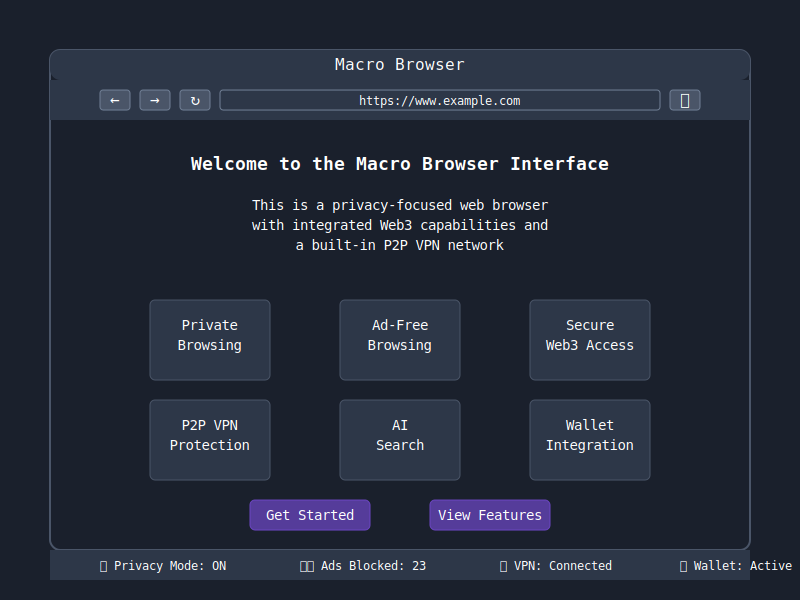
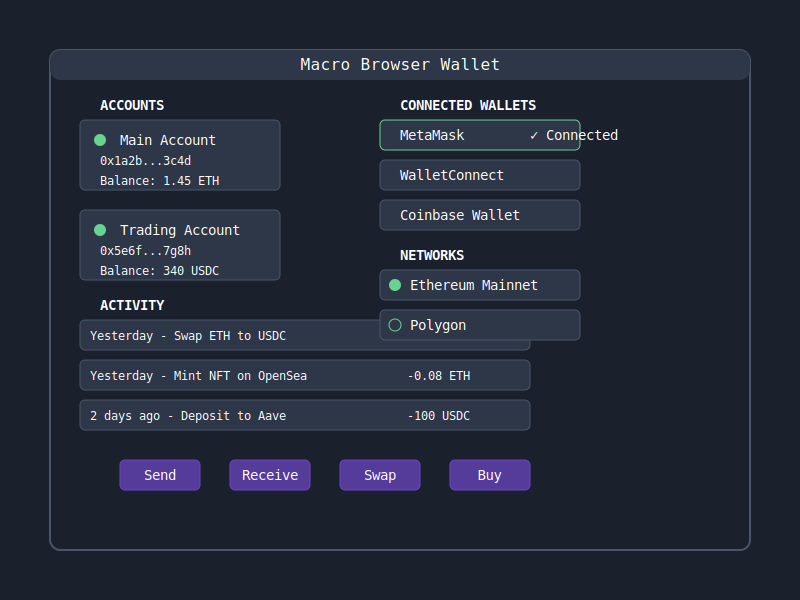

# Macro Browser User Interface

This guide introduces the key elements of the Macro Browser user interface and how to navigate through them.

## Main Interface

The main browser interface combines familiar browsing controls with Macro's unique privacy and Web3 features:

The interface includes:
- Navigation controls (back, forward, refresh)
- Address/search bar with built-in privacy indicators
- Access to wallet integration
- Privacy status indicators
- Web3 connection status

## New Tab Page

The new tab page provides quick access to frequently used Web3 services and privacy statistics:

Features include:
- Privacy-focused search
- Quick links to popular DeFi, NFT, and Web3 services
- Real-time privacy statistics (trackers blocked, time saved)
- Wallet overview showing current balances

## Wallet Interface

The integrated wallet interface provides secure access to your crypto assets:

Key wallet features:
- Multiple account management
- Transaction history
- Connected dApp management
- Support for multiple blockchain networks
- Direct integration with popular Web3 services

## Settings Panel

The settings panel allows you to customize Macro Browser according to your preferences:

- Privacy settings (ad blocking, anti-fingerprinting, etc.)
- VPN configuration
- Wallet settings
- Theme and appearance
- Advanced browser settings

## Status Bar

At the bottom of the browser, the status bar provides at-a-glance information about:
- Current privacy protection status
- Number of trackers/ads blocked on the current page
- VPN connection status
- Wallet connection status

## Main Browser Window

The Macro Browser interface follows a clean, minimal design with a dark theme by default. Here are the main components:

### Address/Search Bar

Located at the top of the window, this unified bar allows you to:
- Enter website URLs directly
- Search the web using the AI-powered search feature
- View security status of the current site

### Navigation Controls

Located to the left of the address bar:
- Back button: Navigate to previous page
- Forward button: Navigate to next page (if available)
- Reload button: Refresh the current page
- Home button: Return to the new tab page

### Tab Management

- Tabs are displayed at the top of the browser window
- "+" button creates a new tab
- Each tab shows a favicon and title when available
- Active tab is highlighted
- Tabs can be closed using the "x" button

### Web3 Controls

Located to the right of the address bar:
- Wallet connection status indicator
- Quick access to connected wallet(s)
- Transaction approval notifications

### Security Controls

Also found in the top right area:
- VPN connection status and toggle
- Ad/tracker blocking statistics
- Privacy mode indicator

## Settings

Access settings by clicking the menu button (three dots) in the top-right corner:
- General settings: Language, default search engine, startup behavior
- Privacy settings: VPN configuration, ad blocking rules
- Web3 settings: Wallet management, network connections
- Appearance: Theme selection, font settings
- Advanced: Developer options, network configuration

## VPN Controls

The VPN feature can be toggled on/off through:
- The VPN icon in the main toolbar
- The privacy settings menu
- The quick settings dropdown

When active, all browser traffic is routed through the secure P2P network. 