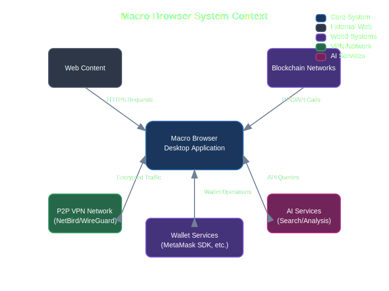

# Technical Architecture

This section provides a detailed overview of Macro Browser's technical architecture and design decisions.

## System Overview

Macro Browser combines traditional web browsing with next-generation privacy and Web3 capabilities.

The diagram above illustrates the high-level architecture of Macro Browser, with core components organized in layers.

## System Context

Macro Browser interacts with multiple external systems to provide its functionality:

This context diagram shows how Macro Browser connects to the web, blockchain networks, P2P VPN infrastructure, wallet services, and AI systems.

## Core Components

Macro Browser consists of several core components working together:

1. **Browser Engine**: Built on Electron/Chromium for cross-platform compatibility
2. **Privacy Layer**: Ad blocking, tracker prevention, and fingerprint protection
3. **P2P VPN**: Secure, decentralized network connectivity
4. **Web3 Bridge**: Connection to blockchain networks and dApps
5. **Wallet Integration**: Secure crypto wallet capabilities
6. **AI Assistant**: Intelligent browsing assistance

## Technical Documentation

For more detailed technical information, please explore the following sections:

- [Browser Engine](./browser-engine.md)
- [Privacy Features](./privacy-features.md)
- [P2P VPN Architecture](./p2p-vpn.md)
- [Web3 Integration](./web3-integration.md)
- [Wallet Architecture](./wallet.md)
- [AI Systems](./ai-systems.md)
- [Security Model](./security-model.md)

## Technology Stack

Macro Browser is built using the following core technologies:

- **Electron**: Cross-platform framework that enables using web technologies to build desktop applications
- **Chromium**: Open-source browser project that powers Macro Browser's rendering engine
- **TypeScript/JavaScript**: Primary programming languages for application logic
- **React**: UI library for building the browser's interface components
- **OpenAI API**: Powers the intelligent search capabilities
- **MetaMask SDK**: Enables wallet connectivity and Web3 functionality
- **WireGuard/NetBird**: Underlying technology for the P2P VPN feature

## Core Architectural Principles

1. **Security by Design**: Security considerations are built into every component from the ground up
2. **Privacy First**: All features prioritize user privacy and data minimization
3. **Modular Components**: Clean separation of concerns allows for independent evolution of features
4. **Zero Trust**: No component inherently trusts another without verification
5. **Graceful Degradation**: Core functionality remains available even if enhanced features are disabled

## System Process Architecture

The browser operates as a desktop application with several processes:

- **Main Process**: Manages application lifecycle and creates renderer processes
- **Renderer Processes**: Handle the display of web content in browser windows
- **GPU Process**: Handles GPU acceleration for rendering
- **Network Service**: Manages network requests and the VPN connection
- **Utility Processes**: Handle various tasks like extension execution

